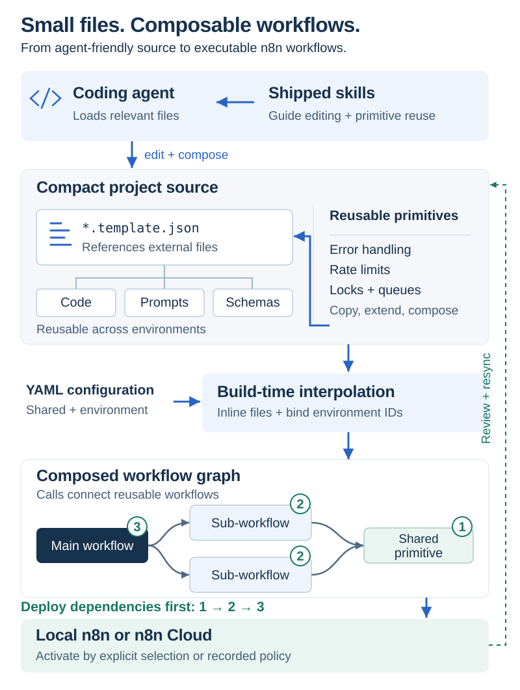

# Architecture and design decisions

Agents edit reusable project files. Each environment has its own workspace and its own n8n deployment. Deploy sends current source to that deployment. Review and resync bring remote edits back. The public guides cover [configuration](../configuration.md), [environments](environments.md), [deploy and resync](sync.md), [adoption](migration.md), and [capabilities](capabilities.md). This page records the boundaries, influences, initial gaps, and migration gates. Line-level review notes stay private.

## Boundaries

| Location | Owns | Rules |
|---|---|---|
| Project | Reusable templates, code, prompts, schemas, assets, tests, instructions, and the manifest | Version controlled; keep the established layout |
| Environment workspace | Target binding, credential references, workflow and node identities, sync baselines, receipts, and builds | One environment and one deployment; secrets and runtime state stay out of Git |
| Installed toolkit | Router, skills, helpers, seed templates, and declared dependencies | Read-only during project operations |
| Machine cache | Downloaded tool dependencies and rebuildable derived data | Deleting it must not lose project files, identity, or synchronization history |

A workspace is this toolkit's local environment context, not an n8n UI project. An n8n project is an optional remote ownership scope. Native n8n Git environments are a different feature; this toolkit uses the public API and does not depend on that feature's license.

Adoption maps existing paths instead of moving files. The manifest holds a schema version, a stable project ID, the path map, the environment-to-workspace map, and optional test and scaffold commands. Environment names are the local identifiers. Secrets come from the selected private environment file or explicitly scoped process variables. Relative paths resolve from the manifest.

Each environment has one authoritative workspace and binds to one target. Two Git worktrees are separate checkouts of that map; concurrent remote changes still require conflict checks. Durable state stays under the mapped environment workspace, or the preserved legacy state directory, and needs a private backup. It is not disposable cache. After state loss, attach verified remote IDs and snapshot again rather than creating replacement workflows.

Separate n8n deployments for development, staging, and production, with distinct databases or volumes, encryption keys, credential stores, webhook endpoints, and execution state. External Redis, queue, and lock keys must also be environment-scoped. Duplicate canonical deployment URLs are rejected. A display-name suffix does not establish isolation.

## Paths and preferences

- Resolve an explicit project path first; otherwise walk upward to the nearest manifest. If none exists, fail with a setup instruction. Only setup creates directories.
- Handle nested projects, symlinks, spaces, alternate layouts, Git worktrees, and invocation outside a Git repository. An explicit path wins. Reject ambiguous legacy roots instead of guessing.
- Resolve the toolkit from its script location, never from the project. Reject path traversal, environment-name escape, and writes into the installed toolkit.
- Apply explicit user preferences, then established project conventions, then bundled defaults.
- Use plain path mappings, command arrays, and selectable scaffolds. Keep the Python/FastAPI preset, JS and Python test helpers, and prompt optimization available. Do not impose a language, host, module format, test runner, workflow DSL, daemon, or general extension framework.

`commands.scaffold` can extend the project's language, framework, and host. The bundled preset remains available.

## Deploy and resync

1. **Select** the environment's configuration and credentials without mutating process-global environment variables. Missing credentials fail closed.
2. **Build** current source. Resolve symbolic workflow and credential references through that environment's bindings. Record a source fingerprint. Do not deploy a file merely because it exists.
3. **Preview** the target, workflow identity, and activation policy. Source creation has no implicit multi-environment network side effect. A target change requires an explicit rebind that leaves old state recoverable.
4. **Deploy** after a remote snapshot and a drift check. Separate deploy and activation outcomes. Cross-workflow operations are not atomic: stop on failure and report partial completion.
5. **Run** by correlating a unique request nonce to saved execution data. An unrelated recent success is not evidence.
6. **Resync** by comparing local content, the last baseline, and current remote content. Remote-only changes can be applied. Local-only changes stay local. Conflicting changes stop for review. A first import has no baseline and must not overwrite existing source.
7. **Apply** by restoring symbolic references, extracting changed code, prompts, and assets, and keeping unknown metadata in the private snapshot. Ambiguous mappings and shared-file conflicts stop for review.

A project lock serializes local deploy and resync operations because environments share source. The public API has no portable conditional update, so a residual race remains. Do not claim conflict-free simultaneous editing. See [Deploy and resynchronize](sync.md).

## Twelve-Factor influences

Borrow config separation, declared dependencies, build/release/run separation, and dev/prod parity. Environment names select workspaces; individual values stay independently configurable. These are influences, not a claim of full [Twelve-Factor](https://12factor.net/) compliance or a fully locked dependency graph.

## Gap from the initial baseline

The inspected baseline already had a router, standalone helpers, externalized source, environment files, deployment, diagnostics, and primitives. The table is the initial gap, not a list of remaining defects. Line-level reproductions stay private.

| Priority | Initial gap | Implemented direction |
|---|---|---|
| P0 | Destructive initialization and direct resync overwrite | Additive adoption, snapshots, staged conflict-aware resync |
| P0 | Working-directory and hardcoded path resolution | One manifest-based context resolver |
| P0 | Environment loading could retain another target's identities | Explicit credential context, target-bound state, rebind guard |
| P0 | Stale builds and implicit writes to every configured environment | Fresh fingerprinted build; explicit selected-environment mutation |
| P0 | Resync could leave literal remote IDs or drop edited code | Structural reversible mapping and extraction |
| P1 | Tooling installed its own dependencies; write guard unused | Immutable tooling, installer-owned dependencies, separate cache |
| P1 | Framework and runner defaults were enforced | Explicit configurable paths and commands, with retained presets |
| P1 | A run could accept an unrelated recent execution | Nonce-correlated checks |
| P1 | Onboarding, schema, layout, and version counts disagreed | Tested onboarding and one release version |

The initial baseline's scoped offline suite passed. That did not establish live success. [Live verification](testing.md) states what later passed and what remains unverified.

## Staged migration

These are full-release acceptance gates, not a claim that every row is live-verified. [Live verification](testing.md) identifies completed scenarios. Optional service integrations need their own live verification.

| Stage | Deliverable | Acceptance gate |
|---|---|---|
| 0 · Freeze the contract | Inventory retained skills, helpers, and both placeholder syntaxes; hash fixtures; label current behavior | Inventory complete; preserve existing instructions, secrets, data, and untracked files |
| 1 · Paths and adoption | Shared resolver, manifest, additive adopt, legacy adapter | Works from the project root and nested directories; rerun is idempotent; pre-existing bytes stay unchanged except reviewed edits |
| 2 · Environment workspaces | Per-environment workspaces, isolated clients, safe rebind | Two real deployments use distinct identities and credentials; one environment's operations leave the other unchanged |
| 3 · Correct round trips | Fresh builds, reversible references, staged resync, conflict handling | Real local round trips pass for code, prompt, schema, node rename, and subworkflow or credential references; conflicts stay recoverable |
| 4 · Runtime and presets | Old entrypoints use the shared context; configurable scaffolds and tests; immutable installation | No capability removals; old fixtures still operate; non-default language, layout, and runner are respected |
| 5 · Documentation and release | Short README, quick start, architecture figure, migration guide, support limits | Mandatory live checks pass on the release commit; clean reinstall; no unsupported safety claims |

Retain helper names, unambiguous flags, plugin commands, hook behavior, skill paths, seeds, and both placeholder spellings. Preserve skill and plugin installation. Dangerous legacy semantics are not compatibility requirements: destructive recreation becomes an explicit archived migration, and silent cross-environment writes require a selected scope.

Migration procedure: inventory and hash, propose the mapping, create missing metadata beside existing files, validate both interpretations, test a disposable environment, then migrate the selected environment. Never delete unknown files, rewrite existing instructions wholesale, move live n8n resources between projects, or remove the old layout on first adoption. Explicit environment migration copies secrets and retains the originals. Setup prints additions and does not persist an initialization receipt. Keep a snapshot and file diff. A Git revert does not roll back n8n execution state. See [Adopt and migrate safely](migration.md).

## Implementation boundary

Separate deployments are the isolation model, not a shared instance with only a project suffix. Local failures are fixed before Cloud checks. The implementation uses conservative whole-template conflict detection and fails on ambiguous composite asset edits. It does not attempt a general merge. Local writes are journaled and rolled back on handled errors. A crash can require manual receipt recovery. Publication depends on the n8n API and version; already-active workflows require explicit publication intent. These limits are documented rather than hidden behind round-trip or atomicity claims.
